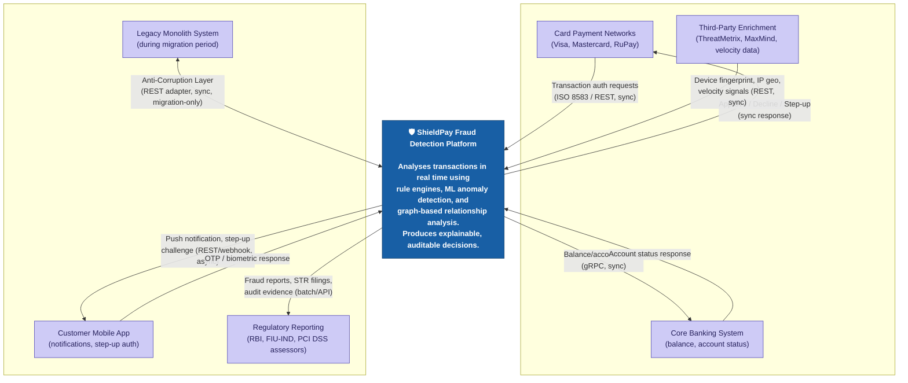

# C4 Level 1 — System Context Diagram

**Day 2 Deliverable | SWE-2C Fraud Detection Microservices Architecture**

## What is C4 Level 1?

Per Section A1.3, Level 1 (System Context) treats the **entire fraud detection
platform as a single black box** and shows only: who/what talks to it, in which
direction, and over what protocol. No internal services are shown yet — that's
Level 2 (Container), which we start drafting below.

## Diagram

## External System Inventory

| External System | Direction | Protocol | Notes |
|---|---|---|---|
| **Card Payment Networks** (Visa, Mastercard, RuPay) | Bidirectional | ISO 8583 / REST, synchronous | The platform must respond within the latency SLA (Auto-Approve/Decline: <100ms) since the network is waiting on the response to forward to the merchant |
| **Core Banking System** | Bidirectional, sync | gRPC | Provides real-time balance/account status; critical-path dependency for some decisions |
| **Customer Mobile Application** | Bidirectional, async | REST/webhook for outbound; REST inbound for OTP/biometric response | Enables step-up authentication flow (score 200-599 band) |
| **Third-Party Enrichment Services** (ThreatMetrix-style device FP, MaxMind-style IP geo, velocity providers) | Inbound to platform, sync | REST | Consumed during Transaction Ingestion's enrichment step |
| **Regulatory Reporting Systems** (RBI, FIU-IND, PCI DSS assessors) | Outbound, mixed sync/batch | API + batch file | STR filings, fraud reporting above 2 lakh INR threshold, audit evidence retrieval |
| **Legacy Monolith System** | Bidirectional, sync, **migration-period only** | REST via Anti-Corruption Layer | Retired incrementally per the Strangler Fig pattern (Section A1.1) — this integration point should shrink to zero over time, not grow |

## Design note: why no internal services appear here

This is intentional, and it's the entire point of C4 Level 1 — stakeholders like the
CFO or Head of Compliance (Section B1.3) need to understand *what the platform does
and who it talks to* without being shown 10 microservices and 5 databases. That level
of detail comes next, in C4 Level 2.
