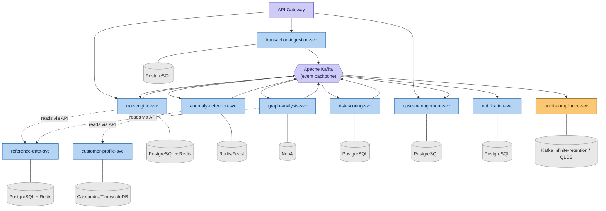

# C4 Level 2 — Container Diagram (DRAFT — finalized on Day 3)

**Day 2 Deliverable | SWE-2C Fraud Detection Microservices Architecture**

> **Status: Draft.** This shows all containers (services, databases, broker) and a
> first pass at communication style. Day 3 will finalise this with explicit
> synchronous (gRPC, solid arrow) vs. asynchronous (Kafka, dashed arrow) labelling
> per hop, plus the API gateway and service mesh layer.

## Diagram (draft)

## What's confirmed vs. still open

**Confirmed today:**
- All 10 service containers
- Each service's dedicated data store (polyglot persistence — no shared databases)
- Kafka as the central event backbone connecting Ingestion → Detection engines → Risk Scoring → downstream consumers
- API Gateway as the single external entry point

**Deliberately left open for Day 3:**
- Exact gRPC method names for synchronous calls (e.g., `RuleEngine.Evaluate`)
- Exact Kafka topic names for each arrow (formalised properly on Day 4, previewed structurally here)
- Service mesh sidecars (Day 10)
- Per-service SLA table (Day 3)

**Our resolution (to be finalised Day 3):** Transaction Ingestion publishes the
enriched transaction to Kafka *and* the critical-path services consume it as a
low-latency streaming read (not a slow batch poll) — Kafka consumer lag for this
path must stay near-zero. This keeps the architecture event-driven and decoupled
(any one detection engine can be down without crashing ingestion) while still
meeting the latency SLA, because a healthy Kafka consumer reads new messages within
single-digit milliseconds. We will document the precise latency trade-off with
numbers on Day 3, since "Latency Hunter" badge criteria (Section B2) require
mathematical justification per hop.
