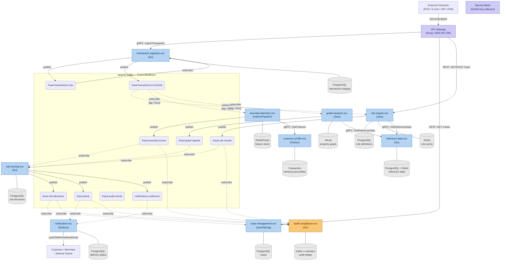

# C4 Level 2 — Container Diagram (FINAL)

**Day 3 Deliverable | SWE-2C Fraud Detection Microservices Architecture**
**Author:** Aditi Sharma | **Date:** 30 June 2026

> Supersedes the draft produced on Day 2. This version finalises:
> - Synchronous gRPC calls (solid arrows, labelled with RPC method name)
> - Asynchronous Kafka events (dashed arrows, labelled with topic name)
> - API Gateway and service mesh layer
> - Per-hop latency budget annotations on the critical path

## Critical path latency decision (open question resolved from Day 2)

Day 2 left open whether Transaction Ingestion → detection engines is sync (gRPC)
or async (Kafka). Resolution:

**The critical path uses BOTH, in sequence:**

1. Transaction Ingestion publishes to `fraud.transactions.enriched` (Kafka) — this
   is the fan-out to Rule Engine, Anomaly Detection, and Graph Analysis in parallel.
2. Each detection engine reads from that topic with a **dedicated low-latency consumer
   group** (lag target: <5ms at steady state — see SLA table).
3. Each engine publishes its result to its own topic.
4. Risk Scoring aggregates the three result topics synchronously via gRPC
   (`RiskScoringService.ComputeScore`) — because it needs all three signals *before*
   it can emit a decision, making this a blocking fan-in.

**Latency budget breakdown (critical path, p99):**

| Hop | Mechanism | Budget |
|---|---|---|
| Channel → API Gateway | TLS/REST | 5ms |
| API Gateway → Transaction Ingestion | gRPC | 5ms |
| Ingestion enrichment (device FP, IP geo) | External REST calls | 20ms |
| Ingestion → Kafka publish | Kafka producer | 2ms |
| Kafka → Rule Engine consumer | Kafka consumer lag | 5ms |
| Rule Engine evaluation | In-memory rule cache | 10ms |
| Kafka → Anomaly Detection consumer | Kafka consumer lag | 5ms |
| Anomaly Detection inference | ONNX/feature store | 10ms |
| Kafka → Graph Analysis consumer | Kafka consumer lag | 5ms |
| Graph Analysis lookup (real-time path only) | Neo4j indexed lookup | 20ms |
| All 3 results → Risk Scoring (gRPC) | gRPC fan-in | 5ms |
| Risk Scoring computation + explanation | In-memory | 3ms |
| **Total p99 critical path** | | **~95ms ✅ < 100ms SLA** |

Note: Rule Engine, Anomaly Detection, and Graph Analysis run **in parallel** after
the Kafka publish — they don't add latency sequentially. The longest of the three
(Graph Analysis at ~30ms) is the effective bottleneck for the parallel batch, not
the sum of all three.

## Diagram

