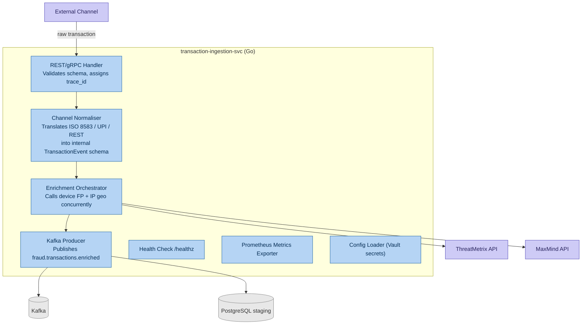
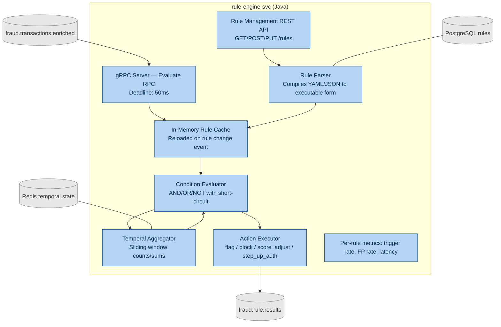
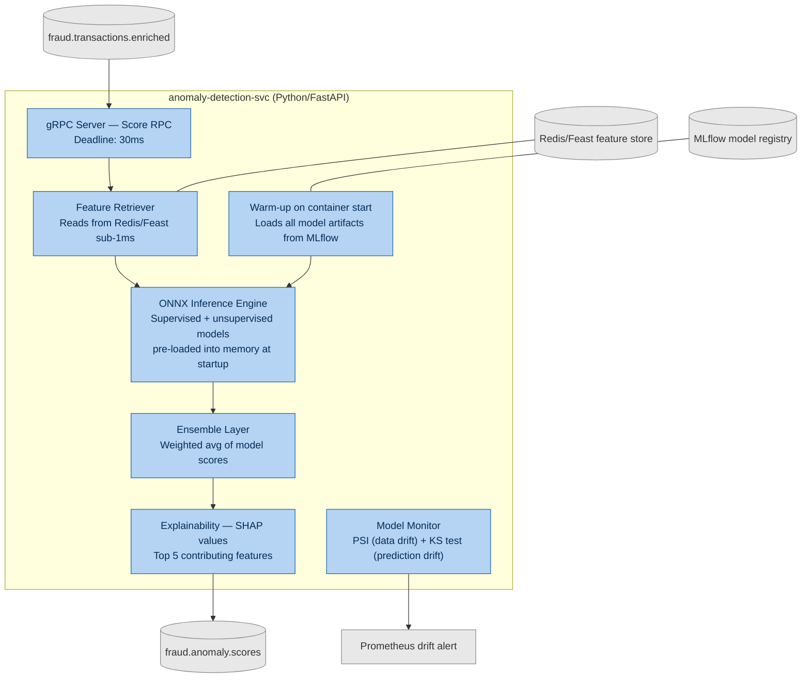
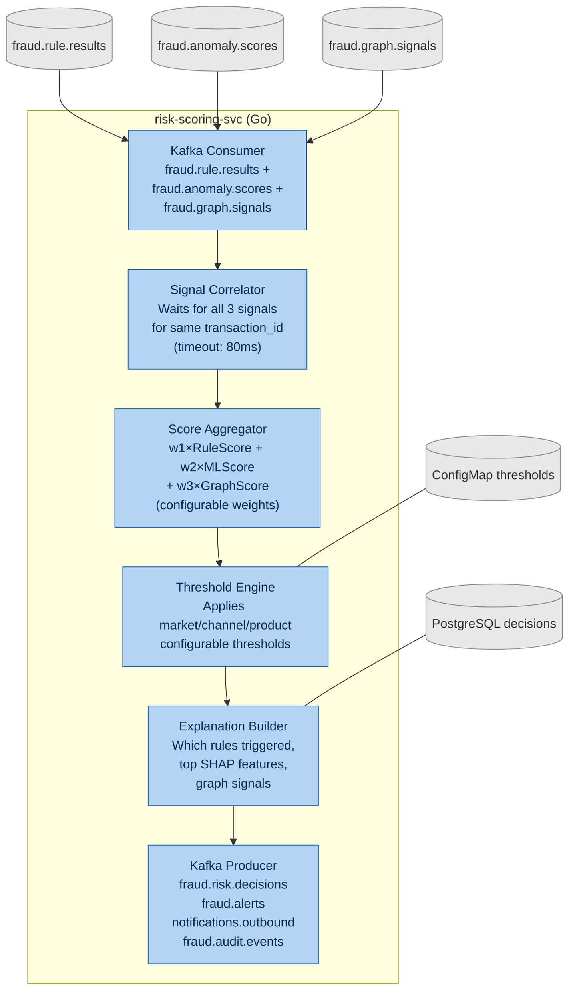

# C4 Level 3 — Component Diagrams (4 Core Services)

**Day 3 Deliverable | SWE-2C Fraud Detection Microservices Architecture**
**Author:** Aditi Sharma | **Date:** 30 June 2026

> C4 Level 3 zooms into individual containers and shows the internal components
> that make each service work. Required for: Transaction Ingestion, Rule Engine,
> Anomaly Detection, Risk Scoring.

---

## Service 1: transaction-ingestion-svc

**Key decisions:** Enrichment runs concurrent goroutines to stay within 20ms budget.
Config Loader pulls secrets from Vault at startup — never baked into the image.

---

## Service 2: rule-engine-svc

**Key decisions:** Rules compiled to in-memory cache — no DB hit on hot path.
Temporal Aggregator persists window state in Redis so pod restarts don't lose velocity counts.
Rule Management API is a separate HTTP endpoint — cannot block live evaluation.

---

## Service 3: anomaly-detection-svc

**Key decisions:** Models pre-loaded at container start (no cold-start latency).
ONNX Runtime chosen for cross-framework portability.
SHAP values computed inline per decision — explainability is a per-decision regulatory requirement.

---

## Service 4: risk-scoring-svc

**Key decisions:** Signal Correlator has 80ms timeout — if Graph Analysis misses
the window, scoring proceeds with Rule + ML only (score adjusted upward by
configurable safety margin). Thresholds live in ConfigMaps — changeable without
a code deployment.
