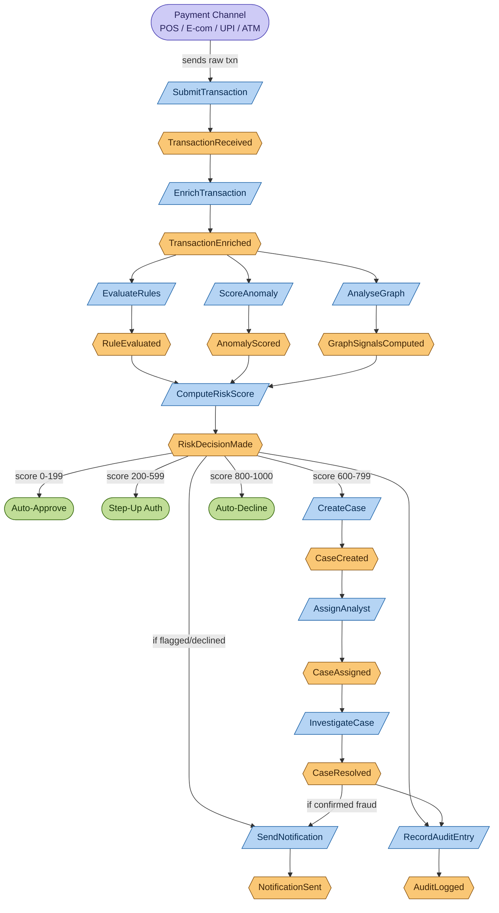

# Event Storming — Transaction Lifecycle (Initial Pass)

**Day 1 Deliverable | SWE-2C Fraud Detection Microservices Architecture**

## What is Event Storming?

Event Storming is a workshop technique (normally done with sticky notes on a wall) for
mapping a business process by identifying:

- 🟠 **Domain Events** — things that *happened*, always named in past tense (`TransactionReceived`)
- 🔵 **Commands** — an intent to *do* something, which causes an event (`SubmitTransaction`)
- 🟡 **Aggregates** — the "thing" that owns the data and enforces consistency for a related cluster of events (`Transaction`, `FraudCase`)
- 🟣 **External Systems** — things outside our control that trigger or receive events

The output below is the **first pass**, covering the happy-path transaction lifecycle as
described in the legacy monolith.

## Transaction Lifecycle — Flow Diagram

## Event → Aggregate Mapping

| Domain Event | Owning Aggregate | Notes |
|---|---|---|
| `TransactionReceived` | `Transaction` | Created the moment a payment channel submits a transaction. |
| `TransactionEnriched` | `Transaction` | Same aggregate, now carrying device/geo/customer-profile data. |
| `RuleEvaluated` | `Transaction` (result attached) | Each rule's outcome is recorded against the transaction. |
| `AnomalyScored` | `Transaction` (result attached) | ML model output, attached as a signal. |
| `GraphSignalsComputed` | `Transaction` (result attached) | Graph relationship signals, attached as a signal. |
| `RiskDecisionMade` | `Transaction` | The terminal state of the detection pipeline for this transaction. |
| `CaseCreated` | `FraudCase` | A *new* aggregate — independent lifecycle from the Transaction once review starts. |
| `CaseAssigned` | `FraudCase` | |
| `CaseResolved` | `FraudCase` | Outcome feeds back to update `CustomerProfile` and potentially `Transaction`. |
| `NotificationSent` | `Notification` | Its own aggregate — tracks delivery status independent of the transaction. |
| `AuditLogged` | `AuditEntry` | Append-only; never modified once created. |

## Pain Points Observed During This Exercise

Doing this exercise surfaced exactly *why* the legacy monolith struggles:

1. **`RuleEvaluated`, `AnomalyScored`, and `GraphSignalsComputed` are naturally parallel** — but in the monolith, ML scoring runs as a *separate batch job*, completely decoupled in time from rule evaluation. This is the structural root cause of the 15-minute fraud window.
2. **`GraphSignalsComputed` doesn't exist in the legacy system at all** — there's no event for it because the capability doesn't exist yet. We're not migrating this capability; we're inventing it.
3. **`CaseCreated` should trigger immediately off `RiskDecisionMade`** — but in a monolith with manual deployment cycles, the wiring between detection and case creation is exactly the kind of "poor integration between detection and response" called out in the Target breach case study (Part C1).

## Next Steps (Day 2 preview)

The five **command clusters** that emerged naturally above —
(1) Ingestion & Enrichment, (2) Detection (Rules/ML/Graph), (3) Risk Scoring,
(4) Case Management, (5) Notification & Audit — are strong early signals for
**bounded contexts**. Tomorrow we'll formalise these using DDD heuristics and produce
the C4 Level 1 diagram.
