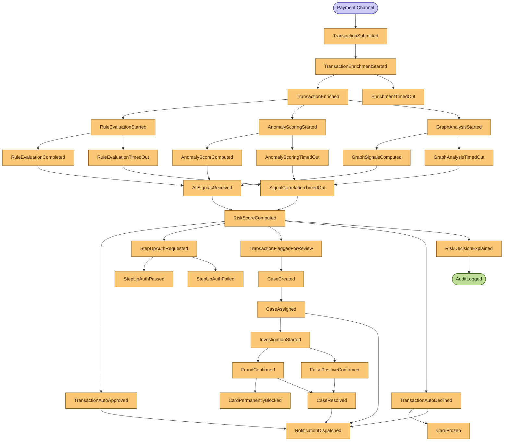

# Event Storming — Full Domain Model (50+ Events)

**Day 6 Deliverable | SWE-2C Fraud Detection Microservices Architecture**
**Author:** Aditi Sharma | **Date:** 3 July 2026

> This is the single source of truth for the event-driven architecture.
> Expands Day 1's 11-event skeleton to 55 domain events covering the complete
> transaction lifecycle including error paths, sagas, and compensating actions.

## Legend
- 🟠 Domain Event (past tense — something that happened)
- 🔵 Command (intent to do something)
- 🟡 Aggregate (owns the data and enforces consistency)
- 🟣 Policy (when [event] then [command])
- 🟢 Read Model (materialised view for queries)
- 🔴 External System

---

## Full Event Inventory (55 events)

### Aggregate: Transaction
| # | Event | Triggering Command | Policy |
|---|---|---|---|
| 1 | `TransactionSubmitted` | `SubmitTransaction` | → EnrichTransaction |
| 2 | `TransactionValidationFailed` | `SubmitTransaction` | → NotifyMerchantOfRejection |
| 3 | `TransactionEnrichmentStarted` | `EnrichTransaction` | |
| 4 | `DeviceFingerprintReceived` | `FetchDeviceFingerprint` | |
| 5 | `DeviceFingerprintUnavailable` | `FetchDeviceFingerprint` | → UseDefaultDeviceRisk |
| 6 | `IPGeolocationReceived` | `FetchIPGeolocation` | |
| 7 | `IPGeolocationUnavailable` | `FetchIPGeolocation` | → UseDefaultGeoRisk |
| 8 | `TransactionEnriched` | `EnrichTransaction` | → EvaluateRules, ScoreAnomaly, AnalyseGraph |
| 9 | `EnrichmentTimedOut` | `EnrichTransaction` | → ProceedWithPartialEnrichment |
| 10 | `RuleEvaluationStarted` | `EvaluateRules` | |
| 11 | `RuleTriggered` | `EvaluateRules` | |
| 12 | `RuleNotTriggered` | `EvaluateRules` | |
| 13 | `VelocityRuleTriggered` | `EvaluateRules` | → IncrementVelocityCounter |
| 14 | `WatchlistMatchFound` | `EvaluateRules` | → EscalateToHighPriority |
| 15 | `RuleEvaluationCompleted` | `EvaluateRules` | → PublishRuleResult |
| 16 | `RuleEvaluationTimedOut` | `EvaluateRules` | → ProceedWithoutRuleScore |
| 17 | `AnomalyScoringStarted` | `ScoreAnomaly` | |
| 18 | `FeaturesFetchedFromStore` | `FetchFeatures` | |
| 19 | `FeatureStoreMiss` | `FetchFeatures` | → UsePopulationAverageFeatures |
| 20 | `AnomalyScoreComputed` | `ScoreAnomaly` | → PublishMLScore |
| 21 | `AnomalyScoringTimedOut` | `ScoreAnomaly` | → ProceedWithoutMLScore |
| 22 | `GraphAnalysisStarted` | `AnalyseGraph` | |
| 23 | `GraphNodeFound` | `AnalyseGraph` | |
| 24 | `GraphNodeCreated` | `AnalyseGraph` | |
| 25 | `FraudRingConnectionFound` | `AnalyseGraph` | → EscalateToHighPriority |
| 26 | `GraphSignalsComputed` | `AnalyseGraph` | → PublishGraphSignals |
| 27 | `GraphAnalysisTimedOut` | `AnalyseGraph` | → ProceedWithSafetyMargin |
| 28 | `AllSignalsReceived` | `CorrelateSignals` | → ComputeRiskScore |
| 29 | `SignalCorrelationTimedOut` | `CorrelateSignals` | → ComputeWithAvailableSignals |
| 30 | `RiskScoreComputed` | `ComputeRiskScore` | |
| 31 | `TransactionAutoApproved` | `ApplyThreshold` | → NotifyApproval, UpdateProfile |
| 32 | `StepUpAuthRequested` | `ApplyThreshold` | → SendOTPChallenge |
| 33 | `StepUpAuthPassed` | `VerifyOTP` | → ApproveTransaction |
| 34 | `StepUpAuthFailed` | `VerifyOTP` | → DeclineTransaction |
| 35 | `StepUpAuthTimedOut` | `VerifyOTP` | → DeclineTransaction |
| 36 | `TransactionFlaggedForReview` | `ApplyThreshold` | → CreateCase |
| 37 | `TransactionAutoDeclined` | `ApplyThreshold` | → NotifyDecline, FreezeCard |
| 38 | `RiskDecisionExplained` | `BuildExplanation` | → WriteAuditEntry |

### Aggregate: FraudCase
| # | Event | Triggering Command | Policy |
|---|---|---|---|
| 39 | `CaseCreated` | `CreateCase` | → AssignCase |
| 40 | `CaseAssigned` | `AssignCase` | → NotifyAnalyst |
| 41 | `CaseReassigned` | `ReassignCase` | → NotifyNewAnalyst |
| 42 | `CaseEscalated` | `EscalateCase` | → NotifyManager |
| 43 | `InvestigationStarted` | `BeginInvestigation` | |
| 44 | `AdditionalEvidenceRequested` | `RequestEvidence` | → NotifyCardholder |
| 45 | `FraudConfirmed` | `RecordDecision` | → BlockCard, InitiateChargeback |
| 46 | `FalsePositiveConfirmed` | `RecordDecision` | → ApproveTransaction, UpdateFPMetrics |
| 47 | `CaseEscalatedToSenior` | `EscalateCase` | → NotifySeniorAnalyst |
| 48 | `CaseResolved` | `CloseCase` | → UpdateCustomerProfile, WriteAuditEntry |

### Aggregate: Card
| # | Event | Triggering Command | Policy |
|---|---|---|---|
| 49 | `CardFrozen` | `FreezeCard` | → NotifyCardholder |
| 50 | `CardUnfrozen` | `UnfreezeCard` | → NotifyCardholder |
| 51 | `CardPermanentlyBlocked` | `BlockCard` | → IssueReplacementCard, NotifyCardholder |
| 52 | `ReplacementCardIssued` | `IssueReplacementCard` | → NotifyCardholder |

### Aggregate: Notification
| # | Event | Triggering Command | Policy |
|---|---|---|---|
| 53 | `NotificationDispatched` | `SendNotification` | |
| 54 | `NotificationDelivered` | `ConfirmDelivery` | |
| 55 | `NotificationFailed` | `RetryNotification` | → RetryWithBackoff (max 3 attempts) |

---

## Event Flow Diagram

