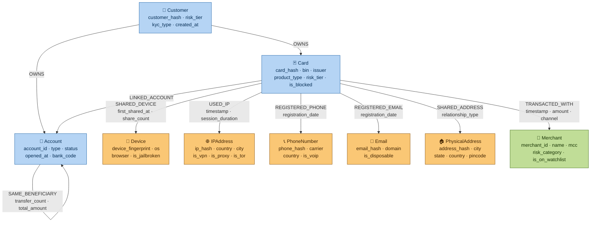

# Graph Schema — Entity Relationship Diagram

**Day 9 Deliverable | SWE-2C Fraud Detection Microservices Architecture**
**Author:** Aditi Sharma | **Date:** 7 July 2026

**Blue nodes** = identity entities (Card, Account, Customer)
**Amber nodes** = infrastructure entities — the key fraud signals
(fraudsters share infrastructure: same device, IP, phone, email, address)
**Green nodes** = merchants (reference data, rarely the primary fraud actor)

The fraud detection intuition: legitimate cardholders have mostly unique
infrastructure (one phone, one home address, their own device). Synthetic
identity rings share infrastructure — many cards pointing to the same device
or IP address is the graph signature we're hunting for.
