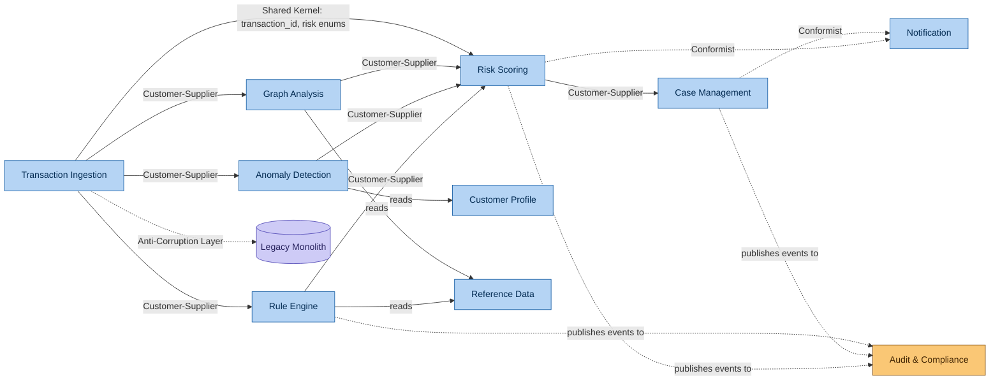

# Bounded Context Map

**Day 2 Deliverable | SWE-2C Fraud Detection Microservices Architecture**

## How we got here

Each bounded context below grew directly out of the Day 1 Event Storming clusters.
For example, the parallel branch of `RuleEvaluated` / `AnomalyScored` /
`GraphSignalsComputed` events became the **Fraud Analysis** context family — but per
the **failure domain isolation** heuristic (Section A1.2), Rule Engine, Anomaly
Detection, and Graph Analysis are kept as *separate* services within that family,
not one big "Fraud Analysis" service. Each has a wildly different computational
profile (rules = deterministic and fast; ML = needs GPU/feature store; graph = needs
Neo4j) — exactly the justification given in Section A1.1 for why microservices
architecture matters here at all.

## The 9 Bounded Contexts

| # | Bounded Context | Responsibility | Owned Data | Why it's separate |
|---|---|---|---|---|
| 1 | **Transaction Ingestion** | Receive & normalise transactions from POS, e-com, UPI, ATM, mobile wallets. Enrich with device fingerprint + IP geolocation. Publish normalised events. | Raw + enriched transaction records (short-lived) | Different scaling profile (must absorb traffic spikes) and different protocol-translation logic per channel |
| 2 | **Rule Engine** | Deterministic, configurable rule evaluation against transaction + temporal aggregates | Rule definitions, versions, evaluation results | Needs sub-50ms deterministic latency; changes via business-user config, not code deploys |
| 3 | **Anomaly Detection** | ML-based scoring (supervised + unsupervised models) | Model artifacts, feature store, scores | Needs GPU/specialised serving infra; independent retraining lifecycle |
| 4 | **Graph Analysis** | Relationship-based fraud ring detection (community detection, centrality, path analysis) | Property graph (Neo4j) | Needs a specialised graph DB; queries run on a completely different latency budget (ms for lookups, minutes for community detection) |
| 5 | **Risk Scoring** | Aggregates Rule + ML + Graph signals into composite score; applies thresholds; produces explainable decisions | Risk decisions, score breakdowns | The single point where all 3 detection signals converge — must stay independent so detection engines can evolve without touching scoring logic |
| 6 | **Case Management** | Human-in-the-loop investigation workflow: assignment, investigation tools, decisions | Fraud cases, investigation notes, analyst assignments | Human-paced workflow (hours), totally different from millisecond transaction path — must not share failure domain with it |
| 7 | **Notification** | Multi-channel alerting (SMS/email/push/webhook/Slack/PagerDuty) with localisation | Notification requests, delivery status, templates | Pure I/O service with zero fraud-detection logic — least-privilege boundary (can't call Rule Engine, per A3.1) |
| 8 | **Audit & Compliance** | Immutable audit trail of every decision, rule change, model deployment | Append-only audit log (hash-chained) | Must be tamper-proof and isolated from every other write path — a Wirecard-style failure (Part C4) starts the moment audit data can be touched by the same process as business logic |
| 9 | **Customer Profile** | Behavioural profile management (typical amounts, merchants, geolocations, devices) | Customer behavioural features | Updated incrementally and continuously — different read/write pattern than transactional data |

**Total: 9 core bounded contexts + 1 lightweight reference-data service = 10 services**

## Context Mapping Patterns

This is the relationship *between* contexts — who depends on whom, and how tightly.

| Pattern | Where it applies | Why |
|---|---|---|
| **Customer-Supplier** | Transaction Ingestion → Rule Engine / Anomaly Detection / Graph Analysis → Risk Scoring | Upstream service's output shape directly drives downstream input contract; downstream depends on upstream, but upstream doesn't know/care about downstream's logic |
| **Conformist** | Notification conforms to event schemas published by Risk Scoring & Case Management | Notification has no leverage to negotiate the schema — it just consumes whatever shape Risk Scoring/Case Management publish |
| **Shared Kernel** | `transaction_id`, risk-level enums shared between Transaction Ingestion and Risk Scoring | A small, deliberately shared vocabulary — kept minimal to avoid coupling |
| **Anti-Corruption Layer** | Transaction Ingestion ↔ Legacy Monolith (during migration) | Prevents the legacy Oracle data model from leaking into new services — per the Strangler Fig pattern (Section A1.1) |
| **Publishes events to (one-way)** | Rule Engine, Risk Scoring, Case Management → Audit & Compliance | Audit only ever *receives* — it never calls back into any other service, preserving its tamper-isolation |

## Why this boundary set, and not others (trade-off notes)

- **Rule Engine, Anomaly Detection, and Graph Analysis are NOT merged into one "Detection" service** even though they conceptually all "detect fraud" — because they have incompatible scaling and deployment needs (Section A1.1: "rule engine needs low-latency deterministic evaluation; anomaly detection may need GPU; graph analysis needs a specialised graph database"). Merging them would re-create the exact coupling problem the monolith has today.
- **Customer Profile is separate from Anomaly Detection**, even though ML feature engineering depends heavily on profile data — because Customer Profile is *continuously* updated by every transaction across the whole platform, while Anomaly Detection's lifecycle is tied to model training/deployment cycles. Different change frequency = different service (Section A1.2 heuristic).
- **Audit & Compliance has no two-way relationships with anything** — every other context publishes *to* it, but it never calls back. This one-directional flow is itself a security property, not just a convenience.
