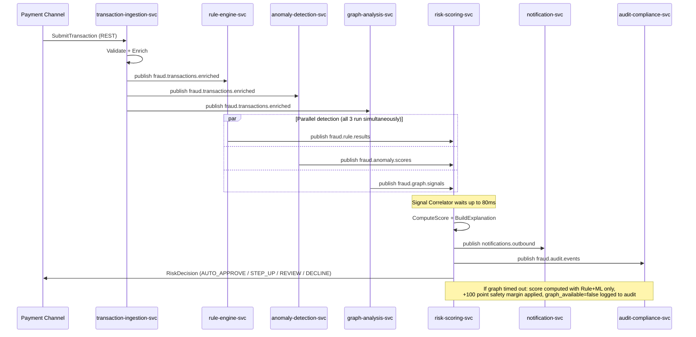
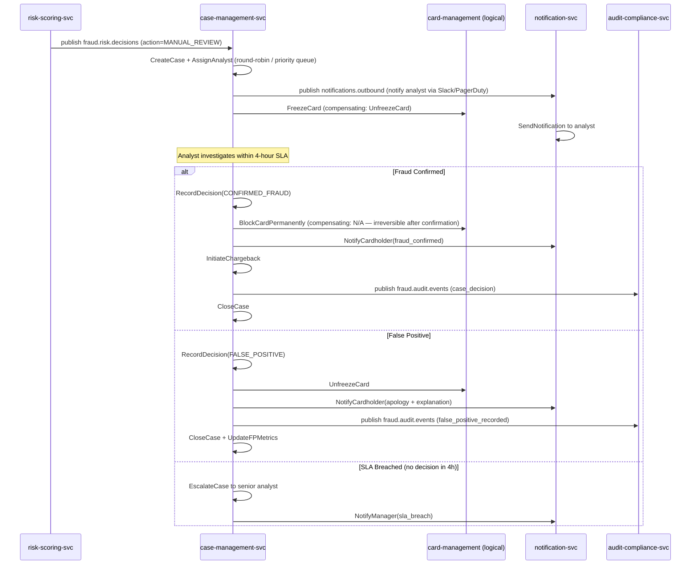
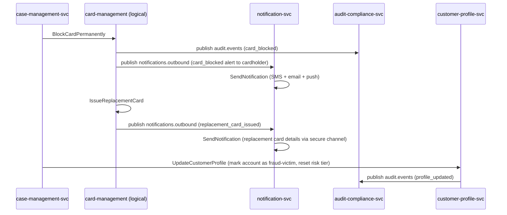

# Saga Orchestration Diagrams

**Day 6 Deliverable | SWE-2C Fraud Detection Microservices Architecture**
**Author:** Aditi Sharma | **Date:** 3 July 2026

> A Saga is a sequence of local transactions where each step publishes an event
> to trigger the next step. If any step fails, compensating transactions undo
> the preceding steps. No two-phase commit — each service only touches its own data.
>
> Orchestration pattern (a central Saga Orchestrator directs all participants) is
> used for complex multi-service workflows like fraud investigation, where partial
> failures have legal/compliance implications and need explicit rollback logic.

---

## Saga 1: Transaction Processing Saga

**Trigger:** `TransactionSubmitted`
**Success end state:** `TransactionAutoApproved` / `StepUpAuthRequested` /
`TransactionFlaggedForReview` / `TransactionAutoDeclined`



**Compensating transactions (failure scenarios):**

| Step | Failure | Compensating Action |
|---|---|---|
| Enrichment times out | External API unavailable | Proceed with partial enrichment, flag `enrichment_partial=true` in audit |
| Rule Engine times out | Service unavailable | Skip rule score, fallback to ML+Graph only, lower approval threshold |
| Anomaly Detection times out | Service/feature store unavailable | Skip ML score, use population-average features in explanation |
| Graph Analysis times out | Neo4j unavailable | Skip graph score, add +100 safety margin, log `graph_skipped=true` |
| Risk Scoring fails | Internal error | Return 503 to channel; transaction not processed; no money moved |

---

## Saga 2: Fraud Investigation Saga

**Trigger:** `TransactionFlaggedForReview` (score 600-799)
**Success end states:** `FraudConfirmed` → chargeback + card block, OR `FalsePositiveConfirmed` → transaction approved



**Compensating transactions:**

| Step | Failure | Compensating Action |
|---|---|---|
| `FreezeCard` fails | card-management unavailable | Log failure to audit; case created anyway; analyst manually freezes |
| `NotifyAnalyst` fails | notification-svc down | Notification queued in Kafka DLQ; retried on recovery |
| `BlockCardPermanently` issued in error | Wrong case resolved as fraud | Requires dual-authorisation reversal — logged as AuditEventType.CONFIG_CHANGE |

---

## Saga 3: Card Blocking Saga

**Trigger:** `FraudConfirmed` from Fraud Investigation Saga



---

## CQRS Read Models for Analytics Dashboard

CQRS (Command Query Responsibility Segregation) separates the write path (transaction
detection pipeline, strong consistency) from the read path (analytics, eventual
consistency). Read models are materialised views, updated by Kafka Streams consumers.

| Read Model | Source Topics | Update Frequency | Storage | Consumer |
|---|---|---|---|---|
| Real-time fraud statistics | `fraud.risk.decisions` | Per event (<1s lag) | TimescaleDB | `analytics-streams-cg` |
| Geographic heat map | `fraud.risk.decisions` | Every 60 seconds (windowed) | TimescaleDB | `geo-aggregator-cg` |
| Rule effectiveness metrics | `fraud.rule.results` | Per event | TimescaleDB | `rule-metrics-cg` |
| ML model performance | `fraud.anomaly.scores` + chargeback data | Daily (chargeback lag 30-90 days) | PostgreSQL | `model-monitor-cg` |
| Case management backlog | `fraud.risk.decisions` + case events | Per event | PostgreSQL | `case-analytics-cg` |

### Kafka Streams topology (real-time fraud statistics read model)

```
Source: fraud.risk.decisions
  → Filter: valid RiskDecision events
  → GroupBy: channel, hour_bucket (tumbling window 1h)
  → Aggregate: count(AUTO_APPROVE), count(AUTO_DECLINE),
               count(STEP_UP_AUTH), count(MANUAL_REVIEW),
               avg(composite_score)
  → Sink: TimescaleDB table `fraud_stats_hourly`
            → served by analytics REST API → Grafana dashboard
```
