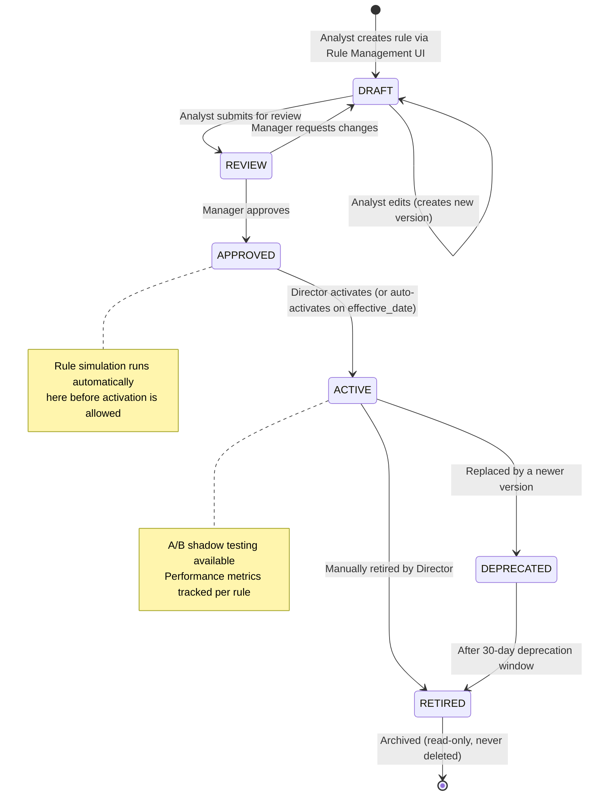
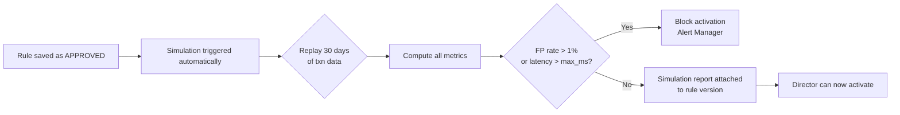

# Rule Engine Lifecycle Management & Simulation

**Day 7 Deliverable | SWE-2C Fraud Detection Microservices Architecture**
**Author:** Aditi Sharma | **Date:** 6 July 2026

---

## Rule Lifecycle State Machine

Every rule moves through a defined lifecycle. No rule is ever deleted —
old versions are archived with their full audit trail.

**Role-based permissions per state transition:**

| Transition | Required Role |
|---|---|
| Create / Edit (DRAFT) | Fraud Analyst |
| Submit for Review | Fraud Analyst |
| Approve / Request Changes | Fraud Manager |
| Activate | Fraud Director |
| Deprecate | Fraud Manager |
| Retire | Fraud Director |
| View any version | All roles |
| Rollback to prior version | Fraud Director |

---

## Rule Simulation Specification

Before any rule can be activated, the Rule Engine runs an automatic backtest
against 30 days of historical transaction data. This prevents deploying rules
that would cause an unacceptable false positive rate in production.

### Simulation inputs
- Rule definition (YAML)
- 30-day historical transaction dataset (anonymised, stored in a dedicated simulation store)
- Confirmed fraud labels from the same 30-day window (from chargeback data)

### Simulation outputs (required fields in simulation report)

| Metric | Description | Alert threshold |
|---|---|---|
| Transactions evaluated | Total transactions tested against this rule | — |
| Transactions flagged | Count and % the rule would have triggered on | Warn if >5% |
| True positives | Flagged transactions confirmed as fraud | — |
| False positives | Flagged transactions confirmed as legitimate | Block activation if FP rate >1% |
| Detection rate (recall) | True positives / all confirmed fraud in window | Warn if <10% (rule catches very little) |
| False positive rate | False positives / all legitimate transactions | **Block activation if >1%** |
| Estimated annual fraud prevented | Projected based on 30-day TP × average fraud amount | — |
| Estimated annual customer friction | Projected based on 30-day FP × step-up/decline actions | — |
| Evaluation latency (p99) | Measured during simulation | Block if >max_evaluation_time_ms |

### Simulation workflow

---

## A/B Testing Specification

After activation, a new rule version can run in shadow mode alongside the
existing active version to validate performance on live traffic before full promotion.

**Shadow mode behaviour:**
- New rule version receives the same transaction data as the active version
- Its output is computed but does NOT influence the actual fraud decision
- Outcomes are compared to the active version over a configurable window (default: 7 days)
- Automated comparison report generated daily showing delta in: detection rate, FP rate, evaluation latency, trigger frequency

**Promotion criteria (all must be met to promote shadow → active):**
- Shadow FP rate ≤ active FP rate + 0.1%
- Shadow detection rate ≥ active detection rate - 2%
- Shadow evaluation latency p99 ≤ active + 5ms
- Minimum 7-day shadow period completed

---

## Rule Performance Monitoring

Every active rule is tracked in real time via Prometheus metrics:

| Metric | Label | Alert |
|---|---|---|
| `rule_trigger_rate` | rule_id, severity | P3 if drops >50% from baseline (rule may be broken) |
| `rule_true_positive_rate` | rule_id | P2 if drops below 5% for HIGH/CRITICAL rules |
| `rule_false_positive_rate` | rule_id | P2 if exceeds 1%; P1 if exceeds 2% |
| `rule_evaluation_latency_ms` | rule_id, p50/p95/p99 | P2 if p99 > max_evaluation_time_ms |
| `rule_evaluation_errors_total` | rule_id | P1 if >0 for CRITICAL rules |

Grafana dashboard "Rule Effectiveness" (Day 12) shows all of the above per rule
with 7-day trend lines and automated P2 alerts when any metric degrades.
