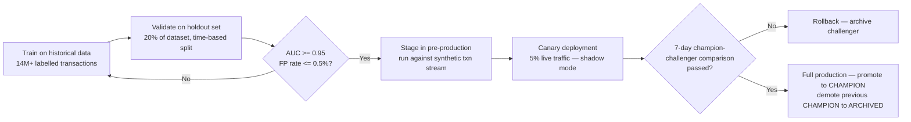
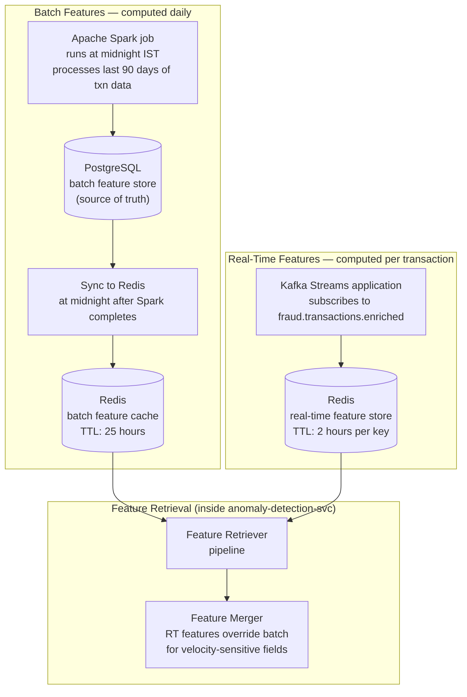
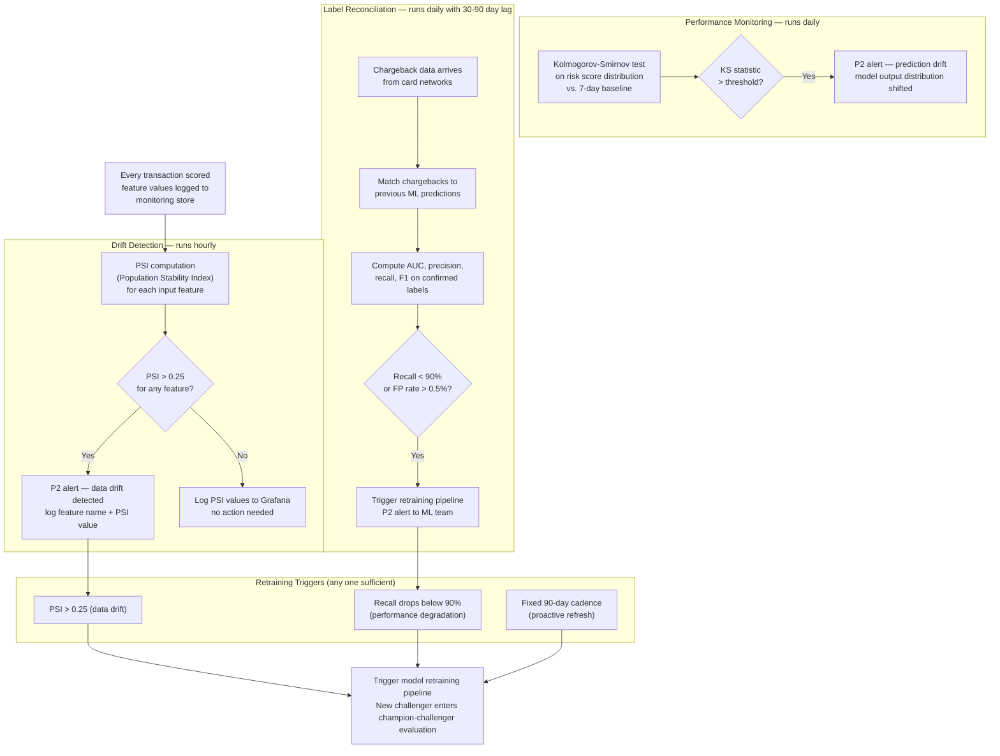
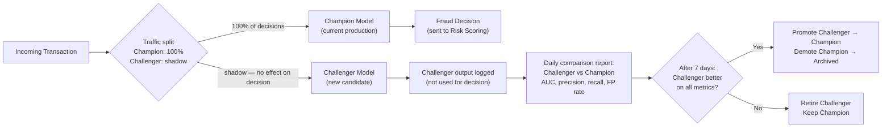

# ML Model Serving & Anomaly Detection Architecture

**Day 8 Deliverable | SWE-2C Fraud Detection Microservices Architecture**
**Author:** Aditi Sharma | **Date:** 6 July 2026

---

## 1. Model Registry

All model artifacts are versioned in **MLflow Model Registry**, self-hosted
on Kubernetes. The registry stores per-version metadata:

| Field | Example |
|---|---|
| model_id | `fraud_supervised_v12` |
| model_type | `SUPERVISED` / `UNSUPERVISED` / `SEQUENCE` |
| framework | `XGBoost` / `PyTorch` / `ONNX` |
| training_date | `2026-06-01` |
| training_dataset_size | `14.2M transactions` |
| training_window | `2025-01-01 to 2026-05-31` |
| validation_auc | `0.9712` |
| validation_precision | `0.884` |
| validation_recall | `0.921` |
| validation_f1 | `0.902` |
| approver | `ml_lead_sharma` |
| deployment_date | `2026-06-15` |
| status | `CHAMPION` / `CHALLENGER` / `ARCHIVED` |

---

## 2. Model Deployment Pipeline



**Why canary for ML models (not blue-green):**
A 5% canary on live traffic generates statistically significant fraud detection
metrics within hours (Section A4.2). Blue-green would require 100% traffic switch
before seeing production metrics — too late to catch a degraded model safely.

---

## 3. Inference Engine — ONNX Runtime

**Choice: ONNX Runtime** over TensorFlow Serving or Triton.

| Factor | ONNX Runtime | TF Serving | Triton |
|---|---|---|---|
| Framework independence | ✅ Any framework → ONNX | ❌ TF/Keras only | ✅ Multi-framework |
| Latency (p99, CPU) | ~4ms | ~6ms | ~3ms |
| GPU scheduling | Basic | No | ✅ Advanced |
| Operational complexity | Low | Medium | High |
| Our models' primary framework | XGBoost + PyTorch → ONNX export | Not applicable | Overkill for our scale |

ONNX Runtime chosen because: our models span XGBoost (supervised) and PyTorch
(sequence LSTM) — ONNX provides a single serving runtime for both, avoiding
two separate serving stacks. Triton would add GPU scheduling we don't yet need.
TF Serving is framework-locked. ONNX Runtime is the pragmatic middle ground.

**Model warm-up:** All model artifacts are loaded into memory at container start
via the `Warm-up` component (Day 3 C4 Level 3). Cold-start latency = 0 on the
hot path. Kubernetes readiness probe waits for warm-up to complete before
the pod receives traffic.

---

## 4. Feature Store Design

Two tiers of features — batch (daily, high accuracy) and real-time (per-transaction,
velocity-sensitive):



### Batch features (computed by Spark, stored in PostgreSQL → synced to Redis)

| Feature | Window | Description |
|---|---|---|
| `avg_amount_30d` | 30 days | Average transaction amount |
| `avg_amount_60d` | 60 days | |
| `avg_amount_90d` | 90 days | |
| `txn_frequency_30d` | 30 days | Transactions per day |
| `preferred_mccs` | 90 days | Top 10 MCCs by transaction count |
| `typical_hour_mean` | 90 days | Mean transaction hour (0-23) |
| `typical_hour_std` | 90 days | Std deviation of transaction hour |
| `home_country` | 90 days | Modal transaction country |
| `online_txn_ratio_30d` | 30 days | % of transactions via e-com/UPI/mobile |
| `card_age_days` | — | Days since card was issued |
| `risk_tier` | 90 days | 0-1 risk tier computed by CustomerProfileService |

### Real-time features (computed by Kafka Streams, stored in Redis with TTL)

| Feature | Window | Description |
|---|---|---|
| `txn_count_1m` | 1 min | Transactions in last 1 minute |
| `txn_count_5m` | 5 min | |
| `txn_count_10m` | 10 min | |
| `txn_count_30m` | 30 min | |
| `txn_count_60m` | 60 min | |
| `cumulative_amount_1h` | 1 hour | Total spend in last hour |
| `cumulative_amount_6h` | 6 hours | |
| `distinct_merchant_count_1h` | 1 hour | |
| `distinct_country_count_24h` | 24 hours | |
| `distance_from_last_txn_km` | — | Haversine distance from previous transaction |
| `time_since_last_txn_min` | — | Minutes since last transaction |

---

## 5. Ensemble Strategy

Three models run in parallel; their scores are combined:

| Model | Type | Algorithm | Score range | Weight |
|---|---|---|---|---|
| Supervised classifier | Supervised | XGBoost (trained on labelled fraud/not-fraud) | 0-1000 | 0.50 |
| Anomaly detector | Unsupervised | Isolation Forest (no labels needed) | 0-1000 | 0.30 |
| Sequence model | Supervised | LSTM on transaction history sequences | 0-1000 | 0.20 |

**Ensemble formula:**
```
ml_score = (0.50 × supervised_score)
         + (0.30 × unsupervised_score)
         + (0.20 × sequence_score)
```

Weights are configurable per channel in ConfigMap — UPI fraud patterns differ
from card CNP patterns and may warrant different weightings over time.

---

## 6. Model Monitoring Pipeline



---

## 7. Champion-Challenger Framework

At any point, production has exactly one **champion** model and optionally
one or more **challenger** models running in shadow mode.



**Promotion criteria (all must hold over the full 7-day shadow period):**
- Challenger AUC ≥ Champion AUC
- Challenger FP rate ≤ Champion FP rate + 0.05%
- Challenger recall ≥ Champion recall - 1%
- Challenger p99 inference latency ≤ Champion p99 + 2ms
