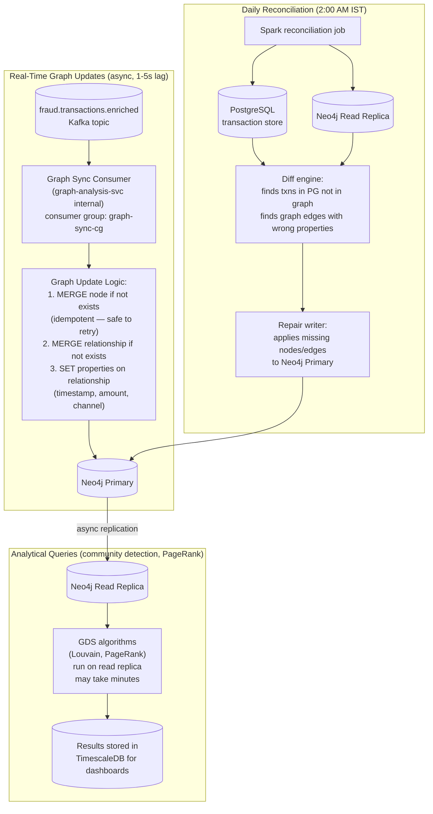

# Graph Synchronisation, Pruning & Maintenance Strategy

**Day 9 Deliverable | SWE-2C Fraud Detection Microservices Architecture**
**Author:** Aditi Sharma | **Date:** 7 July 2026

---

## Graph Update Strategy — Asynchronous (chosen)

Two patterns evaluated per Section A2.4:

| | Synchronous Update | Asynchronous Update (CHOSEN) |
|---|---|---|
| Mechanism | Graph updated inline during transaction processing | Graph updated via Kafka consumer after transaction completes |
| Latency impact | +5-15ms on every transaction | 0ms on transaction (1-5s staleness window) |
| Consistency | Graph always current | Graph up to 5s stale |
| Risk | One slow Neo4j write can breach the 100ms SLA | Fraud committed in the 1-5s window is not graph-detected (but rule + ML still fire) |
| Failure impact | Neo4j downtime = transaction pipeline blocked | Neo4j downtime = graph analysis degrades gracefully; transaction pipeline unaffected |

**Decision: Asynchronous chosen.** The 1-5 second staleness window is acceptable
because: (1) rule-based and ML detection still fire in real time during the window,
providing partial coverage; (2) the graph's primary value is detecting *patterns*
across many transactions over time — a 5-second lag has negligible impact on
pattern detection quality; (3) decoupling graph writes from the transaction path
is the direct application of the Netflix "design for failure" lesson (Part C3) —
Neo4j availability must not gate transaction approval.

**Reconciliation mechanism for asynchronous update:**
A daily batch reconciliation job (Spark) compares the graph state against the
transactional PostgreSQL database and repairs any discrepancies caused by missed
Kafka messages or consumer failures. This ensures the graph never permanently
diverges from the source of truth.

---

## Graph Synchronisation Architecture



**Why MERGE not CREATE for graph updates:**
`MERGE` is idempotent — if the node/relationship already exists, it's updated
rather than duplicated. This means Kafka consumer retries (e.g. after a
transient Neo4j timeout) never create duplicate nodes. `CREATE` would create
duplicates on retry, corrupting the graph structure.

---

## Graph Pruning Strategy

Without pruning, the graph grows indefinitely. At 2.4M transactions/day,
the `TRANSACTED_WITH` relationship alone generates ~2.4M new edges daily.
Over 3 years that's ~2.6 billion edges — unmanageable without pruning.

**Pruning rules:**

| Relationship type | Retention | Reason |
|---|---|---|
| `TRANSACTED_WITH` | 180 days | Core fraud detection signal; patterns older than 6 months rarely relevant |
| `USED_IP` | 90 days | IP addresses rotate frequently; old associations mislead |
| `SHARED_DEVICE` | 365 days | Devices persist longer; device sharing patterns relevant for a year |
| `SHARED_ADDRESS` | 365 days | Physical addresses change slowly |
| `REGISTERED_PHONE` | 365 days | Phone numbers persist |
| `SAME_BENEFICIARY` | 180 days | Transfer patterns older than 6 months deprioritised |

**Pruning job (runs daily at 3:00 AM IST):**
```cypher
// Remove TRANSACTED_WITH edges older than 180 days
MATCH ()-[r:TRANSACTED_WITH]->()
WHERE r.timestamp < datetime() - duration({days: 180})
WITH r LIMIT 50000  // batch delete to avoid locking the graph
DELETE r

// After edge deletion: remove orphaned nodes (nodes with no relationships)
MATCH (n)
WHERE NOT (n)--()
  AND NOT n:Merchant   // merchants are reference data — keep even if no recent txns
DELETE n
```

**Pruned data is archived to cold storage (S3/GCS) in JSON format** before
deletion, satisfying the RBI 7-year retention requirement without bloating
the operational graph.

---

## Read Replica Strategy

| Query type | Runs on | Why |
|---|---|---|
| Real-time fraud lookups (shortest path, subgraph match) | **Primary** | Must be current; <50ms target |
| Community detection (Louvain) | **Read Replica** | Takes minutes; must not block primary |
| PageRank centrality | **Read Replica** | Takes minutes; analytical, not real-time |
| Temporal growth queries (Query 4) | **Primary** | Indexed timestamp; fast enough for primary |
| Daily reconciliation reads | **Read Replica** | Avoids load on primary during reconciliation |

Read replicas receive async replication from the primary with typical lag <1 second —
acceptable for analytical workloads that already run on a scheduled basis.

---

## Graph Index Design Summary

```cypher
// Unique constraints (also create indexes automatically)
CREATE CONSTRAINT card_hash_unique IF NOT EXISTS
  FOR (c:Card) REQUIRE c.card_hash IS UNIQUE;

CREATE CONSTRAINT device_fp_unique IF NOT EXISTS
  FOR (d:Device) REQUIRE d.device_fingerprint IS UNIQUE;

CREATE CONSTRAINT ip_hash_unique IF NOT EXISTS
  FOR (ip:IPAddress) REQUIRE ip.ip_hash IS UNIQUE;

CREATE CONSTRAINT merchant_id_unique IF NOT EXISTS
  FOR (m:Merchant) REQUIRE m.merchant_id IS UNIQUE;

CREATE CONSTRAINT phone_hash_unique IF NOT EXISTS
  FOR (p:PhoneNumber) REQUIRE p.phone_hash IS UNIQUE;

CREATE CONSTRAINT email_hash_unique IF NOT EXISTS
  FOR (e:Email) REQUIRE e.email_hash IS UNIQUE;

CREATE CONSTRAINT address_hash_unique IF NOT EXISTS
  FOR (a:PhysicalAddress) REQUIRE a.address_hash IS UNIQUE;

// Composite index for time-windowed relationship queries
CREATE INDEX transacted_timestamp IF NOT EXISTS
  FOR ()-[r:TRANSACTED_WITH]-() ON (r.timestamp);

// Full-text index for fuzzy merchant name matching
CREATE FULLTEXT INDEX merchant_name_fulltext IF NOT EXISTS
  FOR (m:Merchant) ON EACH [m.name];
```
