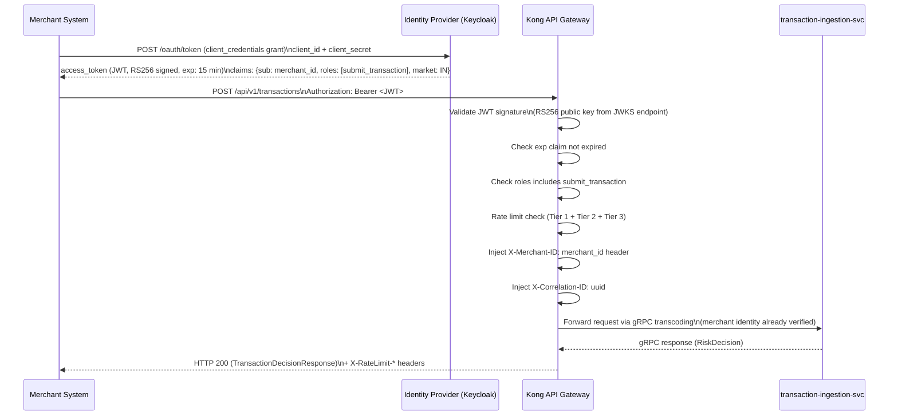
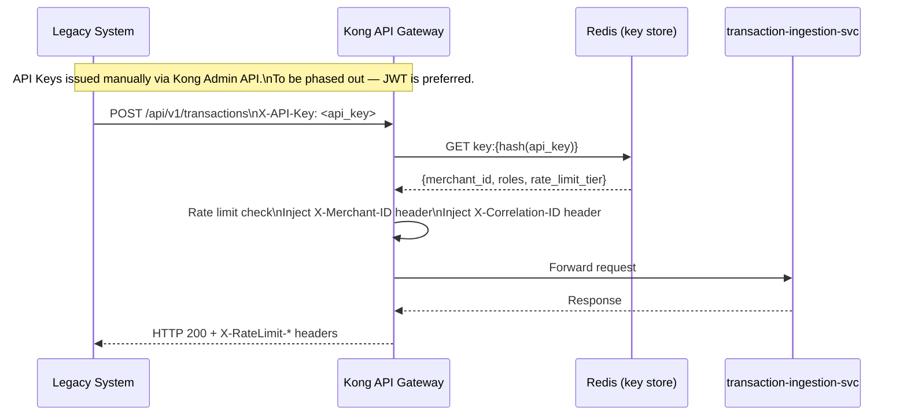
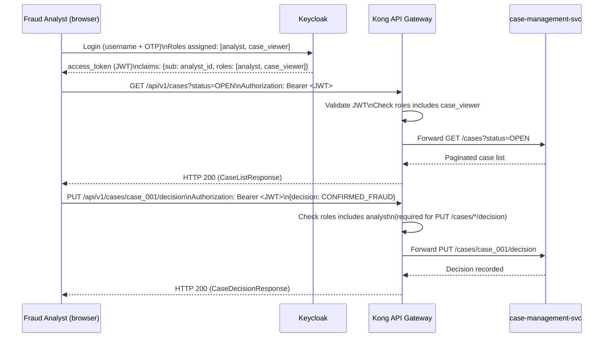
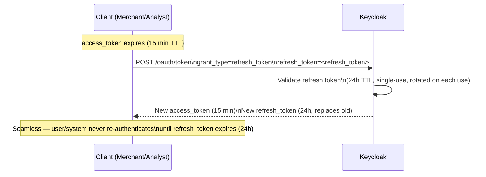

# Authentication Flow Diagrams

**Day 11 Deliverable | SWE-2C Fraud Detection Microservices Architecture**
**Author:** Aditi Sharma | **Date:** 9 July 2026

---

## Flow 1 — JWT (Primary: Merchant to Platform)

---

## Flow 2 — API Key (Legacy Integrations Only)

---

## Flow 3 — Analyst Dashboard (Role-Based JWT)

---

## Token Refresh Flow

