# CI/CD Pipeline Design

**Day 14 Deliverable | SWE-2C Fraud Detection Microservices Architecture**
**Date:** 12 July 2026

> CI/CD tool: **GitHub Actions** (primary) with ArgoCD for GitOps-based
> Kubernetes deployment. Every service has its own pipeline — independent
> deployment is a core microservices principle; a shared pipeline would
> reintroduce the coupling the architecture is designed to eliminate.

---

## Pipeline Stages (per service)

```mermaid
flowchart LR
    S1["1. SOURCE\nPR opened or\npush to main"] -->
    S2["2. BUILD\nDocker multi-stage\nbuild + image tag"] -->
    S3["3. TEST\nUnit + integration\ntests + coverage gate"] -->
    S4["4. SCAN\nSAST + SCA +\ncontainer image scan"] -->
    S5["5. STAGE\nDeploy to staging\nsmoke tests"] -->
    S6["6. CANARY\n5% live traffic\nautomated analysis"] -->
    S7["7. PRODUCTION\nFull rollout or\nblue-green switch"]

    style S1 fill:#B5D4F4,stroke:#185FA5,color:#042C53
    style S2 fill:#B5D4F4,stroke:#185FA5,color:#042C53
    style S3 fill:#FAC775,stroke:#854F0B,color:#412402
    style S4 fill:#FAC775,stroke:#854F0B,color:#412402
    style S5 fill:#CECBF6,stroke:#534AB7,color:#26215C
    style S6 fill:#CECBF6,stroke:#534AB7,color:#26215C
    style S7 fill:#C0DD97,stroke:#3B6D11,color:#173404
```



---

## GitHub Actions Workflow — rule-engine-svc (Blue-Green)

```yaml
# .github/workflows/rule-engine-svc.yml
name: rule-engine-svc CI/CD

on:
  push:
    branches: [main]
    paths: ['services/rule-engine-svc/**']
  pull_request:
    paths: ['services/rule-engine-svc/**']

env:
  SERVICE: rule-engine-svc
  REGISTRY: ghcr.io/shieldpay
  NAMESPACE: fraud-detection

jobs:

  # ── Stage 2: BUILD ────────────────────────────────────────────────────
  build:
    runs-on: ubuntu-latest
    outputs:
      image_tag: ${{ steps.meta.outputs.tags }}
      image_digest: ${{ steps.build.outputs.digest }}
    steps:
      - uses: actions/checkout@v4

      - name: Docker metadata
        id: meta
        uses: docker/metadata-action@v5
        with:
          images: ${{ env.REGISTRY }}/${{ env.SERVICE }}
          tags: |
            type=sha,prefix=,format=short
            type=ref,event=branch

      - name: Build and push
        id: build
        uses: docker/build-push-action@v5
        with:
          context: services/rule-engine-svc
          file: services/rule-engine-svc/Dockerfile
          push: true
          tags: ${{ steps.meta.outputs.tags }}
          labels: ${{ steps.meta.outputs.labels }}
          cache-from: type=gha
          cache-to: type=gha,mode=max

  # ── Stage 3: TEST ─────────────────────────────────────────────────────
  test:
    runs-on: ubuntu-latest
    needs: build
    steps:
      - uses: actions/checkout@v4

      - name: Run unit tests
        run: |
          cd services/rule-engine-svc
          mvn test -q

      - name: Run integration tests (Testcontainers)
        run: |
          cd services/rule-engine-svc
          mvn verify -Pintegration -q

      - name: Coverage gate
        run: |
          # Fail if coverage < 80%
          mvn jacoco:check -Djacoco.minimum.coverage=0.80

  # ── Stage 4: SCAN ─────────────────────────────────────────────────────
  scan:
    runs-on: ubuntu-latest
    needs: build
    steps:
      - uses: actions/checkout@v4

      - name: SAST — static analysis
        uses: github/codeql-action/analyze@v3
        with:
          languages: java

      - name: SCA — dependency vulnerability scan
        uses: snyk/actions/maven@master
        env:
          SNYK_TOKEN: ${{ secrets.SNYK_TOKEN }}
        with:
          args: --severity-threshold=high  # fail on HIGH or CRITICAL CVEs

      - name: Container image scan
        uses: aquasecurity/trivy-action@master
        with:
          image-ref: ${{ needs.build.outputs.image_tag }}
          format: sarif
          exit-code: 1             # fail pipeline on HIGH/CRITICAL vulnerabilities
          severity: HIGH,CRITICAL

  # ── Stage 5: STAGING ──────────────────────────────────────────────────
  deploy-staging:
    runs-on: ubuntu-latest
    needs: [test, scan]
    if: github.ref == 'refs/heads/main'
    environment: staging
    steps:
      - uses: actions/checkout@v4

      - name: Update staging image tag (GitOps)
        run: |
          # ArgoCD watches this file — updating the tag triggers a staging deploy
          yq e '.spec.template.spec.containers[0].image = "${{ env.REGISTRY }}/${{ env.SERVICE }}:${{ needs.build.outputs.image_tag }}"' \
            -i gitops/staging/rule-engine-svc/deployment.yaml
          git config user.name "CI Bot"
          git config user.email "ci@shieldpay.in"
          git commit -am "ci: deploy rule-engine-svc ${{ needs.build.outputs.image_tag }} to staging"
          git push

      - name: Wait for ArgoCD sync
        run: |
          argocd app wait rule-engine-svc-staging \
            --health --timeout 300

      - name: Smoke tests against staging
        run: |
          cd services/rule-engine-svc
          ./scripts/smoke-test.sh https://api-staging.shieldpay.in

  # ── Stage 6 & 7: PRODUCTION (Blue-Green) ─────────────────────────────
  deploy-production:
    runs-on: ubuntu-latest
    needs: deploy-staging
    environment: production           # requires manual approval in GitHub
    steps:
      - uses: actions/checkout@v4

      - name: Deploy to GREEN environment (inactive)
        run: |
          # Update green deployment (inactive — zero live traffic)
          yq e '.spec.template.spec.containers[0].image = "${{ env.REGISTRY }}/${{ env.SERVICE }}:${{ needs.build.outputs.image_tag }}"' \
            -i gitops/production/rule-engine-svc/deployment-green.yaml
          git commit -am "ci: deploy rule-engine-svc ${{ needs.build.outputs.image_tag }} to green"
          git push

      - name: Wait for GREEN to be healthy
        run: |
          kubectl rollout status deployment/rule-engine-svc-green \
            -n ${{ env.NAMESPACE }} --timeout=300s

      - name: Run integration test suite against GREEN
        run: ./scripts/integration-test.sh green

      - name: Switch traffic BLUE → GREEN (atomic)
        run: |
          # Update Istio VirtualService: 100% weight to green
          kubectl patch virtualservice rule-engine-svc -n ${{ env.NAMESPACE }} \
            --type='json' \
            -p='[{"op":"replace","path":"/spec/http/0/route/0/weight","value":0},
                 {"op":"replace","path":"/spec/http/0/route/1/weight","value":100}]'

      - name: Monitor for 10 minutes post-switch
        run: |
          # Check error rate every 30s for 10 minutes
          for i in $(seq 1 20); do
            ERROR_RATE=$(promtool query instant \
              'fraud:service_error_rate:5m{service="rule-engine-svc"}' \
              | jq -r '.data.result[0].value[1]')
            if (( $(echo "$ERROR_RATE > 0.01" | bc -l) )); then
              echo "ERROR: Error rate $ERROR_RATE exceeds 1% — rolling back"
              kubectl patch virtualservice rule-engine-svc -n ${{ env.NAMESPACE }} \
                --type='json' \
                -p='[{"op":"replace","path":"/spec/http/0/route/0/weight","value":100},
                     {"op":"replace","path":"/spec/http/0/route/1/weight","value":0}]'
              exit 1
            fi
            sleep 30
          done
          echo "Green is healthy — blue-green switch complete"
```

---

## Deployment Strategy Per Service (Section A4.2)

| Service | Strategy | Justification |
|---|---|---|
| **rule-engine-svc** | Blue-Green | Rules must be atomically switched — either all apply or none apply. Partial rule sets during a canary would mean some transactions get evaluated by old rules, some by new. Unacceptable for fraud detection correctness. |
| **anomaly-detection-svc** | Canary (5% → 25% → 50% → 100%) | ML model accuracy is validated on live traffic. A 5% canary generates statistically significant fraud detection metrics within hours. Blue-green would switch 100% before we see any signal. |
| **transaction-ingestion-svc** | Rolling update | High-volume, stateless processing. Readiness probes ensure old pods continue processing until new pods are ready — zero message loss. |
| **risk-scoring-svc** | Rolling update | Stateless computation. Readiness probe ensures the pod is ready (ConfigMap thresholds loaded) before receiving traffic. |
| **case-management-svc** | Rolling update | Human-paced workflow service — brief overlap of old/new version during roll is acceptable. |
| **notification-svc** | Rolling update | I/O-bound, stateless. Brief overlap is fine since notifications are idempotent (duplicate delivery is handled by delivery tracking). |
| **audit-compliance-svc** | Blue-Green | Audit schema changes must be atomic. A mixed old/new schema would corrupt the Merkle hash chain if both versions are writing simultaneously. |
| **Database schema migrations** | Expand-Contract pattern | Expand: add new column (both old and new code can run). Migrate: deploy new code. Contract: remove old column once no old pods remain. Never break existing schema for running pods. |
