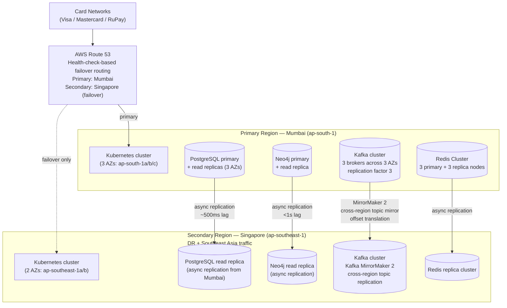

# Disaster Recovery Plan & Multi-Region Deployment Topology

**Day 14 Deliverable | SWE-2C Fraud Detection Microservices Architecture**
**Date:** 12 July 2026

---

## Multi-Region Deployment Topology



---

## RPO & RTO Targets Per Service Tier

| Tier | Services | RPO | RTO | Replication | Failover type |
|---|---|---|---|---|---|
| **Tier 1 (Critical path)** | txn-ingestion, rule-engine, anomaly-detection, risk-scoring | < 1 minute | < 5 minutes | Synchronous within region; async cross-region | Automated (pre-provisioned standby) |
| **Tier 2 (Supporting)** | case-management, notification, analytics | < 15 minutes | < 30 minutes | Async cross-region | Semi-automated |
| **Tier 3 (Non-critical)** | Reporting, admin tools | < 1 hour | < 4 hours | Daily backup | Manual |

**Why RPO < 1 minute for Tier 1:** A transaction decision that is made but not durably stored before a failure could be replayed by the card network, leading to either a duplicate approval or a missed block. Synchronous replication within the primary region ensures the decision is written to at least 2 availability zones before the response is returned.

---

## Failover Runbook

### Detection Criteria (automated health checks)

```yaml
# Route 53 health check config
health_check:
  type: HTTPS
  resource_path: /healthz
  fqdn: api.shieldpay.in
  port: 443
  request_interval: 10          # check every 10 seconds
  failure_threshold: 3          # 3 consecutive failures = unhealthy (30s detection)
  regions:
    - ap-south-1      # Mumbai
    - ap-southeast-1  # Singapore
    - us-east-1       # Virginia (independent vantage point)
```

The primary region is declared unhealthy when health checks from **all 3 vantage
points** fail consecutively. Requiring all 3 prevents a single network partition
from triggering a false failover.

### Decision Matrix (who authorises failover)

| Scenario | Auto-failover | Manual approval required |
|---|---|---|
| Primary completely unreachable (all 3 health check regions fail) | ✅ Automatic via Route 53 | No |
| Primary degraded (high error rate but not down) | ❌ | CTO + On-call Lead must agree |
| Planned maintenance | ❌ | CTO approves maintenance window |
| Security incident (suspected breach) | ❌ | CTO + CISO must agree |

### Execution Steps

```bash
# AUTOMATED (Route 53 triggers this automatically):
# 1. Route 53 flips DNS to Singapore endpoint (TTL: 60s — propagation in <2 min)

# MANUAL verification steps (run by on-call engineer):

# Step 1 — Verify Singapore cluster is healthy
kubectl get pods -n fraud-detection --context=singapore-cluster
kubectl get hpa -n fraud-detection --context=singapore-cluster

# Step 2 — Verify Kafka MirrorMaker has replicated all topics
kafka-consumer-groups --bootstrap-server kafka-sg:9092 \
  --describe --group mirrormaker2-offset-syncs

# Step 3 — Promote Singapore PostgreSQL replica to primary
# (done via cloud provider console or CLI — pg_promote() or RDS failover)
aws rds failover-db-cluster --db-cluster-identifier fraud-detection-sg

# Step 4 — Verify Singapore Neo4j is accepting writes
# (Neo4j replica becomes primary automatically when primary is unreachable)
cypher-shell -a bolt://neo4j-sg:7687 "CALL dbms.cluster.role()"

# Step 5 — Confirm first transactions are processing in Singapore
kubectl logs -n fraud-detection -l app=transaction-ingestion-svc \
  --context=singapore-cluster --tail=20

# Step 6 — Alert card networks of regional failover (via operations team)
# Notify Visa/Mastercard/RuPay operations contacts of the DR event

# Step 7 — Update incident status page
# Post to status.shieldpay.in: "Fraud detection platform operating from
# Singapore region. No impact to transaction processing expected."
```

### Verification Steps (confirm DR region is fully operational)

```bash
# Run synthetic transaction through Singapore cluster
./scripts/synthetic-transaction-test.sh --endpoint https://api-sg.shieldpay.in

# Expected: AUTO_APPROVE response in <200ms
# If FAIL or >200ms: escalate to Platform Lead immediately

# Check all services are healthy
kubectl get pods -n fraud-detection --context=singapore-cluster | grep -v Running
# Expected: no output (all pods Running)

# Verify Kafka consumer groups are active
kafka-consumer-groups --bootstrap-server kafka-sg:9092 \
  --describe --all-groups | grep -E "LAG|TOPIC"
# Expected: LAG column shows <1000 for all critical-path topics
```

### Rollback to Primary (when Mumbai is restored)

```bash
# Step 1 — Verify Mumbai cluster is healthy
kubectl get pods -n fraud-detection --context=mumbai-cluster

# Step 2 — Re-sync data from Singapore back to Mumbai
# PostgreSQL: pg_basebackup or replication restart (depends on RTO during incident)
# Kafka: MirrorMaker 2 auto-resumes bidirectional sync

# Step 3 — Flip Route 53 DNS back to Mumbai (manual, requires CTO approval)
aws route53 change-resource-record-sets \
  --hosted-zone-id Z1234567890 \
  --change-batch file://dns-failback-mumbai.json

# Step 4 — Monitor for 30 minutes post-failback
# Watch Dashboard 1 (Transaction Processing) for any anomalies
```

---

## Chaos Engineering Strategy (Section A4.3)

5 chaos experiments with expected behaviour, validation criteria, and monitoring signals:

| # | Experiment | Tool | Expected behaviour | Validation criteria | Monitoring signal |
|---|---|---|---|---|---|
| 1 | **Pod termination** — randomly kill rule-engine-svc pods | Chaos Monkey / `kubectl delete pod` | HPA spins up replacement pods within 30s; Kafka consumer group rebalances; no transaction decisions missed | Zero DLQ messages during experiment; p99 latency stays <200ms | `kube_pod_container_status_restarts_total`, `fraud:pipeline_latency_p99:5m` |
| 2 | **Network partition** — block traffic between anomaly-detection-svc and Redis feature store | Istio fault injection | Anomaly Detection falls back to population-average features; `FeatureStoreMiss` event logged; WARN log emitted | `ml.feature_store_hit = false` in spans; no ERROR-level logs; pipeline continues | `redis_hit_rate`, `fraud:service_error_rate:5m{service="anomaly-detection-svc"}` |
| 3 | **Latency injection** — add 80ms artificial latency to graph-analysis-svc | Istio fault injection | Signal Correlator timeout fires; Risk Scoring proceeds with Rule + ML only; `graph.timed_out = true` in spans; score safety margin applied | `graph_signal_used = false` in RiskDecision events; composite scores average +100 points higher | `graph.timed_out` custom span attribute, `fraud:decision_rate:auto_decline:5m` |
| 4 | **Kafka broker failure** — kill one of 3 Kafka brokers | `kubectl delete pod kafka-broker-1` | Kafka partition leader election completes within 30s; consumer groups rebalance; producer retries succeed; no message loss | Zero DLQ messages; consumer lag recovers to <1000 within 2 minutes | `kafka_controller_active_controller_count`, `fraud:kafka_lag_max:critical_path` |
| 5 | **Database failover** — trigger PostgreSQL primary failover | Cloud provider failover API | Services retry connection; read replicas promoted; transactions resume within RTO <5 minutes; no decisions permanently lost | All Tier 1 services reconnect within 5 minutes; zero permanent data loss | `pg_up`, `fraud:service_error_rate:5m`, `fraud:transaction_rate:1m` |
